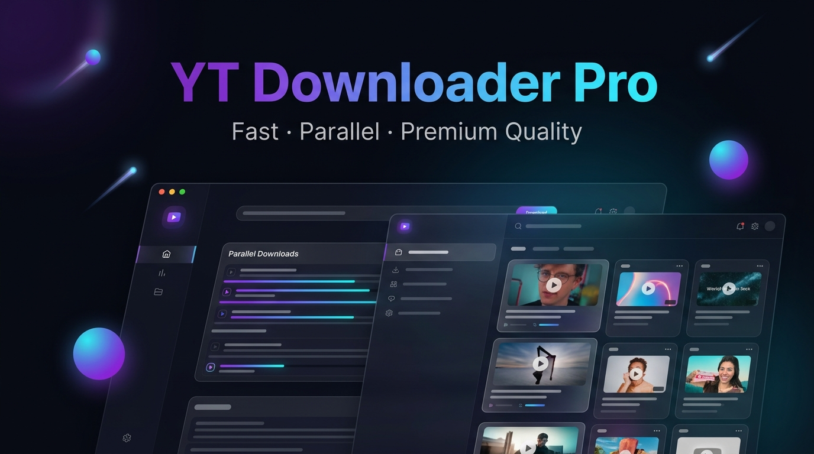
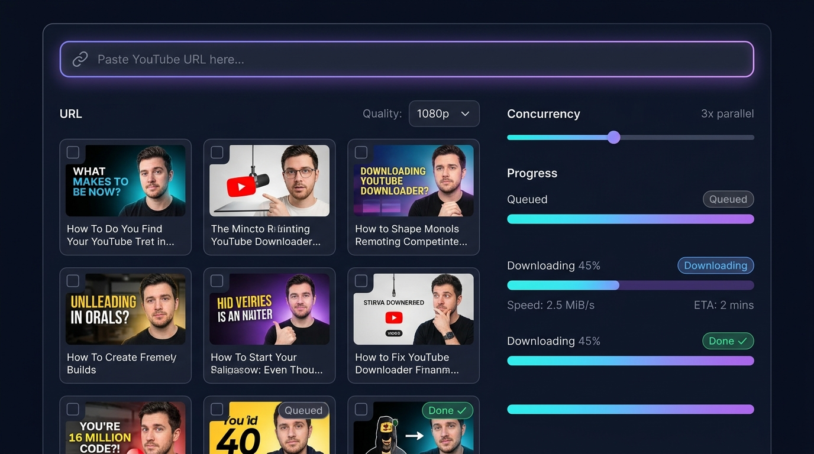

<div align="center">



<br/><br/>

# 🎬 YT Downloader Pro

### Fast · Parallel · Premium Quality

A locally-hosted, full-stack web application for downloading YouTube videos and playlists — with real-time progress, parallel workers, quality control, and a stunning glassmorphism UI.

<br/>

[](https://python.org)
[](https://fastapi.tiangolo.com)
[](https://github.com/yt-dlp/yt-dlp)
[](LICENSE)

<br/>

[**🚀 Quick Start**](#-quick-start) · [**✨ Features**](#-features) · [**🛠️ Tech Stack**](#️-tech-stack) · [**📡 API Reference**](#-api-reference) · [**🎨 UI Preview**](#-ui-preview)

</div>

---

## 🎨 UI Preview

<div align="center">

</div>

> **Dark glassmorphism UI** with real-time animated progress bars, parallel download workers, and per-video status tracking.

---

## ✨ Features

<table>
<tr>
<td width="50%">

### 🔗 Smart URL Detection
Paste any YouTube URL — single video, playlist, or short link (`youtu.be`). The backend automatically detects the type and returns the correct metadata shape.

### ⚡ Parallel Downloads
Download up to **5 videos simultaneously** using `asyncio` + `ThreadPoolExecutor`. Each worker runs independently, so one failure never blocks the others.

### 📡 Real-Time Live Progress
Powered by **Server-Sent Events (SSE)**. Per-video progress bars update live with `%`, speed (`MiB/s`), and ETA — all without polling or page refresh.

</td>
<td width="50%">

### 🎛️ Full Quality Control
Choose from **6 quality presets**:
- ✅ Best Available
- 🎥 1080p · 720p · 480p · 360p
- 🎵 Audio Only (MP3)

### 🗂️ Playlist Cherry-Picking
Browse the full playlist with thumbnail previews. **Select individual videos** or use Select All. Videos are saved in ordered, named folders.

### 🔧 Repair Mode
Already downloaded a playlist? Use **Repair** to re-verify, fix missing files, and reconcile renamed entries — without re-downloading complete files.

</td>
</tr>
</table>

---

## 🚀 Quick Start

### Prerequisites

| Requirement | Version | Notes |
|-------------|---------|-------|
| **Python** | 3.10+ | Must be on PATH |
| **ffmpeg** | Any recent | Required for 1080p / audio merging |

> 💡 Don't have ffmpeg? The app bundles it automatically via `imageio-ffmpeg` — no manual install needed!

### Installation

```bash
# 1. Clone the repository
git clone https://github.com/DashingDivyansh/YT-DOWNLOADER.git
cd YT-DOWNLOADER

# 2. Install Python dependencies
pip install -r requirements.txt

# 3. Launch the server
python server.py
```

**4. Open your browser → `http://localhost:8000`** 🎉

> Downloaded files are saved to the `downloads/` folder in the project root.

---

## 🛠️ Tech Stack

| Layer | Technology | Purpose |
|-------|-----------|---------|
| **Backend** | Python 3.10+ · **FastAPI** | Async API server, Swagger docs at `/docs` |
| **Download Engine** | **yt-dlp** | Best-in-class YouTube extractor & downloader |
| **Post-processing** | **ffmpeg** / `imageio-ffmpeg` | Merges separate video+audio streams for 1080p |
| **Concurrency** | `asyncio` + `ThreadPoolExecutor` | True parallel downloads without GIL blocking |
| **Real-time** | **Server-Sent Events (SSE)** | Zero-overhead live progress from server → browser |
| **Frontend** | Vanilla HTML + CSS + JS | No build step · Zero dependencies · Instant load |
| **File Serving** | FastAPI `StaticFiles` + `FileResponse` | Serves UI assets and delivers completed downloads |

---

## 📡 API Reference

<details>
<summary><strong>POST /api/fetch</strong> — Extract metadata from a YouTube URL</summary>

**Request:**
```json
{ "url": "https://www.youtube.com/watch?v=dQw4w9WgXcQ" }
```

**Response (single video):**
```json
{
  "type": "video",
  "videos": [{
    "id": "dQw4w9WgXcQ",
    "title": "Never Gonna Give You Up",
    "thumbnail": "https://i.ytimg.com/vi/dQw4w9WgXcQ/hqdefault.jpg",
    "duration": "3:33",
    "channel": "Rick Astley"
  }],
  "qualities": ["Best Available", "1080p", "720p", "480p", "360p", "Audio Only (MP3)"]
}
```

**Response (playlist):**
```json
{
  "type": "playlist",
  "playlist_title": "My Awesome Playlist",
  "videos": [ { "id": "...", "title": "...", "index": 1, ... } ],
  "qualities": ["Best Available", "1080p", ...]
}
```
</details>

<details>
<summary><strong>POST /api/download</strong> — Start a parallel download session</summary>

**Request:**
```json
{
  "videos": ["dQw4w9WgXcQ", "oHg5SJYRHA0"],
  "quality": "720p",
  "concurrent": 3,
  "playlist_title": "My Playlist",
  "items": [
    { "id": "dQw4w9WgXcQ", "title": "Video 1", "index": 1 }
  ],
  "repair": false
}
```

**Response:**
```json
{ "session_id": "a1b2c3d4-e5f6-..." }
```
</details>

<details>
<summary><strong>GET /api/progress/{session_id}</strong> — SSE live progress stream</summary>

Streams Server-Sent Events. Each event is a JSON payload:

```json
{ "video_id": "dQw4w9WgXcQ", "status": "downloading", "percent": 45.2, "speed": "2.5 MiB/s", "eta": "12s" }
{ "video_id": "dQw4w9WgXcQ", "status": "done", "filename": "Never_Gonna_Give_You_Up.mp4" }
{ "video_id": "oHg5SJYRHA0", "status": "error", "error": "Video unavailable" }
{ "status": "close" }
```

| Status | Meaning |
|--------|---------|
| `queued` | Worker slot not yet available |
| `downloading` | Actively downloading with progress |
| `done` | Complete — download link available |
| `skipped` | File already exists on disk |
| `error` | Download failed (reason included) |
| `close` | Session finished — all workers done |
</details>

<details>
<summary><strong>GET /api/file/{filename}</strong> — Download a completed file</summary>

Serves the file from the `downloads/` directory to the browser. Path-traversal protected.

```
GET /api/file/My_Playlist/001_-_Video_Title.mp4
```
</details>

---

## 📁 Project Structure

```
YT-DOWNLOADER/
├── 📄 server.py                  # Entry point (runs uvicorn)
├── 📋 requirements.txt           # Python dependencies
├── 📖 PLAN.md                    # Architecture & feature plan
│
├── 📦 app/
│   ├── main.py                  # FastAPI app, CORS, static serving
│   ├── api/
│   │   └── routes.py            # /fetch, /download, /progress endpoints
│   ├── models/
│   │   └── schemas.py           # Pydantic request/response models
│   └── services/
│       ├── youtube.py           # yt-dlp integration, parallel download logic
│       └── sse_manager.py       # Server-Sent Events session manager
│
├── 🎨 frontend/
│   ├── index.html               # Semantic HTML, full feature UI
│   ├── styles.css               # Glassmorphism design system
│   └── app.js                   # SSE client, progress rendering, fetch/download
│
├── 📥 downloads/                # Downloaded files land here (git-ignored)
├── 🧪 tests/                    # Pytest test suite
└── 🖼️ assets/                   # Repository images
```

---

## 🔒 Safety & Reliability

- **`restrictfilenames: True`** — Prevents filesystem errors from special characters on Windows/Linux
- **`safe_publish()`** — All SSE calls are wrapped in `try/except`; hook errors never crash the download worker
- **`asyncio.gather(..., return_exceptions=True)`** — Session always closes cleanly even if a future raises unexpectedly
- **`terminal_sent` flag** — Guarantees exactly one terminal state (`done`/`error`) per video, no duplicate events
- **`finally` failsafe** — A `finally` block sends an error SSE if the thread crashes in an unexpected way
- **Path traversal guard** — `/api/file/` validates the resolved path stays inside `downloads/`

---

## 🧪 Running Tests

```bash
pytest tests/ -v
```

---

## ⚙️ Configuration

| Setting | Default | Description |
|---------|---------|-------------|
| Download folder | `./downloads/` | Where files are saved |
| Server port | `8000` | Edit `server.py` to change |
| Max concurrency | `5` | Enforced by backend schema |
| Default concurrency | `3` | Best balance of speed vs. rate limiting |
| Merge format | `mp4` | Video+audio container for non-audio downloads |

---

## 🤝 Contributing

Pull requests are welcome! For major changes, please open an issue first.

1. Fork the repo
2. Create your branch: `git checkout -b feat/amazing-feature`
3. Commit your changes: `git commit -m 'feat: add amazing feature'`
4. Push to the branch: `git push origin feat/amazing-feature`
5. Open a Pull Request

---

<div align="center">

Made with ❤️ using **FastAPI** · **yt-dlp** · **ffmpeg** · Vanilla JS

<br/>

⭐ **Star this repo if it helped you!** ⭐

</div>
